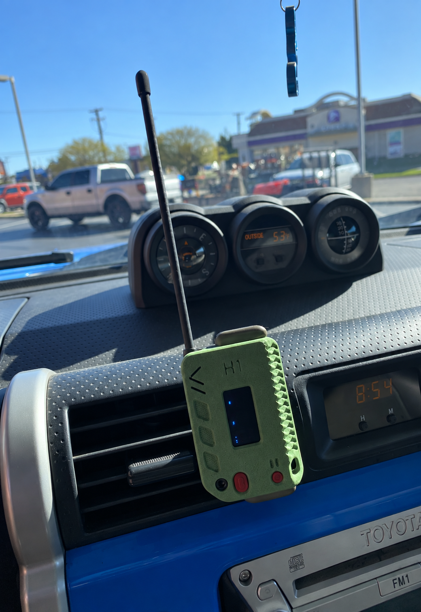

---
tags:
  - Info
  - Getting Started
  - Meshtastic
  - MeshCore
hide:
  - navigation
---

# About

## What is Chicagoland Mesh?

We are a growing community building an off-grid, decentralized, and resilient communications network using inexpensive LoRa devices. Founded March 2024, Chicagoland Mesh utilizes MeshCore, Meshtastic, and Reticulum protocols to build a mesh network. The devices we use are called "nodes" and can be placed anywhere to expand the coverage of the network. Operating within the unlicensed 915 MHz ISM band, these devices let you communicate without any traditional network infrastructure.

The FCC allows people to operate on ISM frequencies without having any form of FCC-affiliated license (such as that required for Ham/Amateur Radio). However, the 902-928 MHz range in particular is special, because transmissions under 1 watt over those frequencies can be encrypted, meaning your private messages will remain secure from prying eyes.

The purpose of Chicagoland Mesh is to expand coverage in our area and build out mesh networks to make them more usable. We currently have a number of nodes located in downtown Chicago and on top of other buildings out in the suburbs. We are always looking to expand our coverage and rely on ourselves and others who can get nodes in elevated places to join us in building our off-grid communications network.

<figure markdown="span">
  { width=500 }
  <figcaption></figcaption>
</figure>

## What is MeshCore?

[MeshCore](https://meshcore.io) is a LoRa mesh protocol built to address the reliability issues that come up in large, dense networks. Rather than having every device repeat every message (which floods the network), MeshCore relies on dedicated repeater infrastructure.

Messages come from lightweight *companion* nodes connected via BLE to your phone, then travel through a network of dedicated *repeater* nodes to reach their destination. The first message floods the network to discover a path. After that, your device remembers the route and uses it directly, which cuts down on congestion significantly.

- Dedicated repeater infrastructure for improved reliability
- Smaller packet sizes that reduce collisions on busy networks
- Path-based routing after initial flood discovery
- Encrypted communication
- BLE-connected or standalone companion node support

## What is Meshtastic?

[Meshtastic®](https://meshtastic.org) is a community-driven LoRa mesh platform that has been in development since 2019. It works in a peer-to-peer fashion where all nodes can repeat messages, making it self-contained and independent of any existing infrastructure. Learn more through the [documentation](https://meshtastic.org/docs/overview).

- Decentralized with no dedicated repeater infrastructure required
- Encrypted communication
- Excellent battery life
- GPS-based location and passive telemetry support
- Large, established ecosystem

## What is Reticulum?

[Reticulum](https://reticulum.network) is a cryptography-based networking stack built for resilient, decentralized communication across a wide variety of transport layers including LoRa, WiFi, and serial links. Unlike MeshCore or Meshtastic, Reticulum is a full networking layer rather than a messaging-focused app, which makes it better suited for more advanced use cases like running applications, hosting services, or bridging different network types.

If you want to go beyond simple text messaging, Reticulum paired with tools like [Nomad Network](https://github.com/markqvist/NomadNet) opens up a broader decentralized communication ecosystem.

## Which Should I Use?

Chicagoland Mesh supports MeshCore, Meshtastic, and Reticulum equally. There is no wrong choice, and running more than one is something we actively encourage. If you are able and willing, running MeshCore and Meshtastic on separate dedicated nodes is a great way to contribute to both networks at once and strengthen overall coverage in the area. Reticulum is recommended for advanced users who want to go deeper than messaging and experiment with off-grid networking at a lower level.

| | MeshCore | Meshtastic | Reticulum |
|---|---|---|---|
| **Best for** | Dense urban areas | Small groups and rural | Advanced multi-transport |
| **Infrastructure** | Dedicated repeaters | Peer-to-peer | Diverse |
| **Telemetry** | On request | Passive/automatic | User-defined |
| **Maturity** | Newer (2024) | Established (2020) | Established (2016) |

If you are in a large city like Chicago, MeshCore is the stronger choice. High-traffic urban environments benefit a lot from its dedicated repeater model and smaller packet sizes, which reduce collisions and improve delivery reliability across a dense network.

For camping trips, rural use, or small group meshes, Meshtastic is the better fit. Its peer-to-peer design works well even with no pre-existing infrastructure, and its passive location tracking and telemetry features are useful for those situations.

Reticulum is worth looking into if you want to go beyond messaging and build more sophisticated off-grid network applications. Hardware is inexpensive, so running all three on separate nodes is very doable if you want to participate in everything the network has to offer.

You can also check out [LunarCore](https://github.com/STCisGOOD/lunarcore) for boards that support running both MeshCore and Meshtastic at the same time.

## Getting Started

1. Join [our Discord](https://chicagolandmesh.org/discord)
2. Purchase [supported hardware](https://www.rfindex.com/mesh/devices) and an [antenna](https://www.rfindex.com/mesh/antennas) and mount it as high as you can
3. Flash your hardware with [MeshCore](https://flasher.meshcore.dev), [Meshtastic](https://flasher.meshtastic.org), or [Reticulum](https://liamcottle.github.io/rnode-flasher/) firmware
4. Download the app and connect to your node:
    - **MeshCore:** [iOS](https://apps.apple.com/us/app/meshcore/id6742354151) · [Android](https://play.google.com/store/apps/details?id=com.liamcottle.meshcore.android)
    - **Meshtastic:** [iOS](https://apps.apple.com/us/app/meshtastic/id1586432531) · [Android](https://play.google.com/store/apps/details?id=com.geeksville.mesh)
    - **Reticulum:** [RNS software](https://reticulum.network/manual/software.html)
5. Read the [getting started guide](guides/index.md) for your chosen protocol
