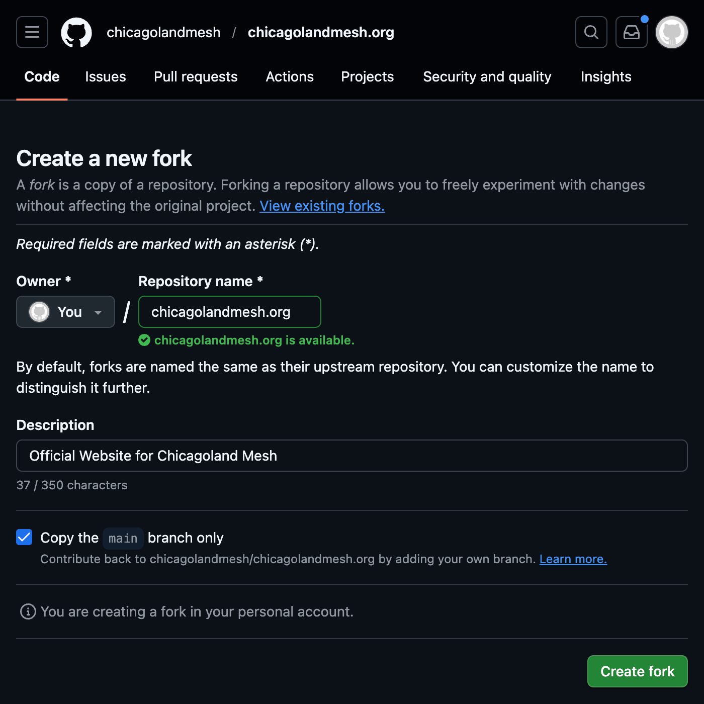
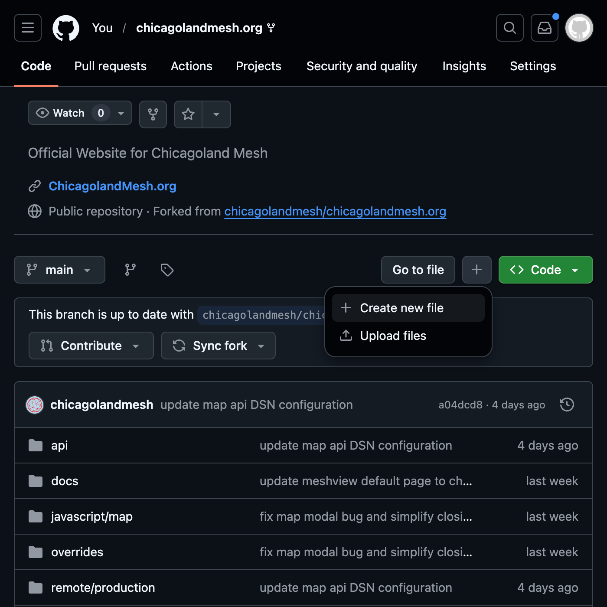
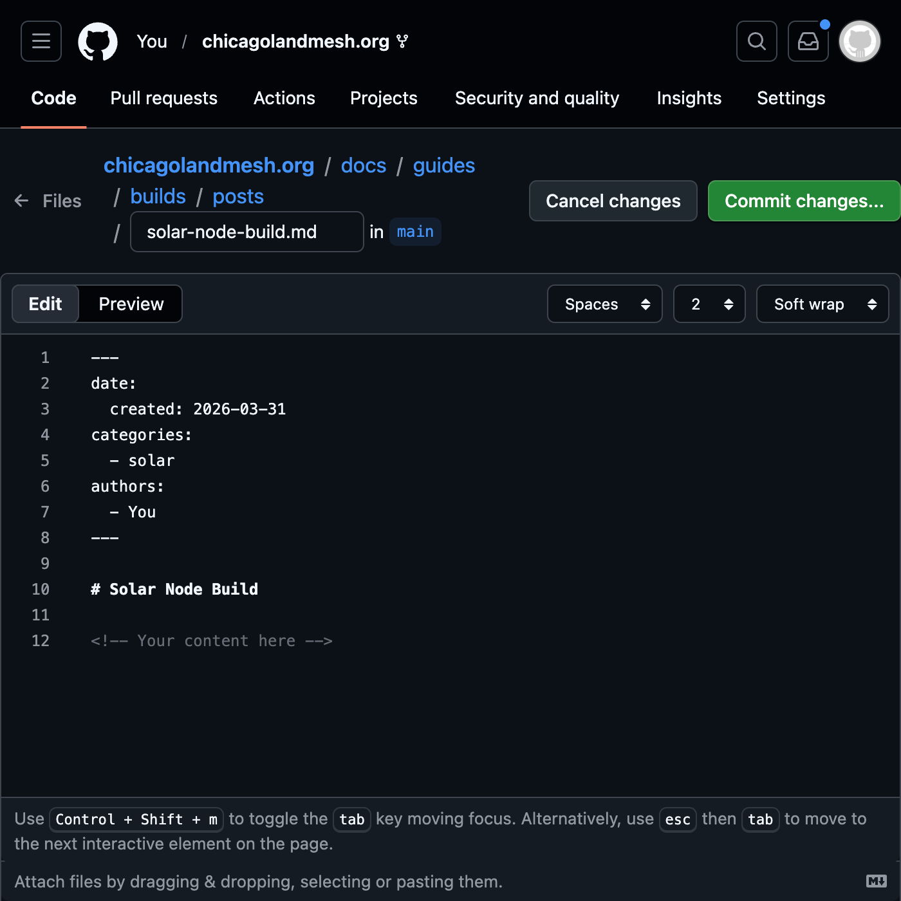
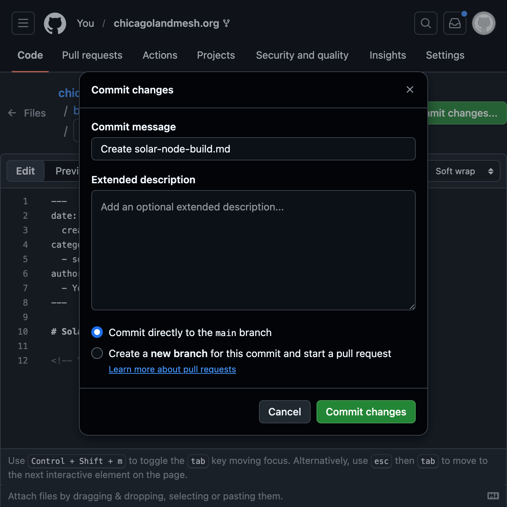
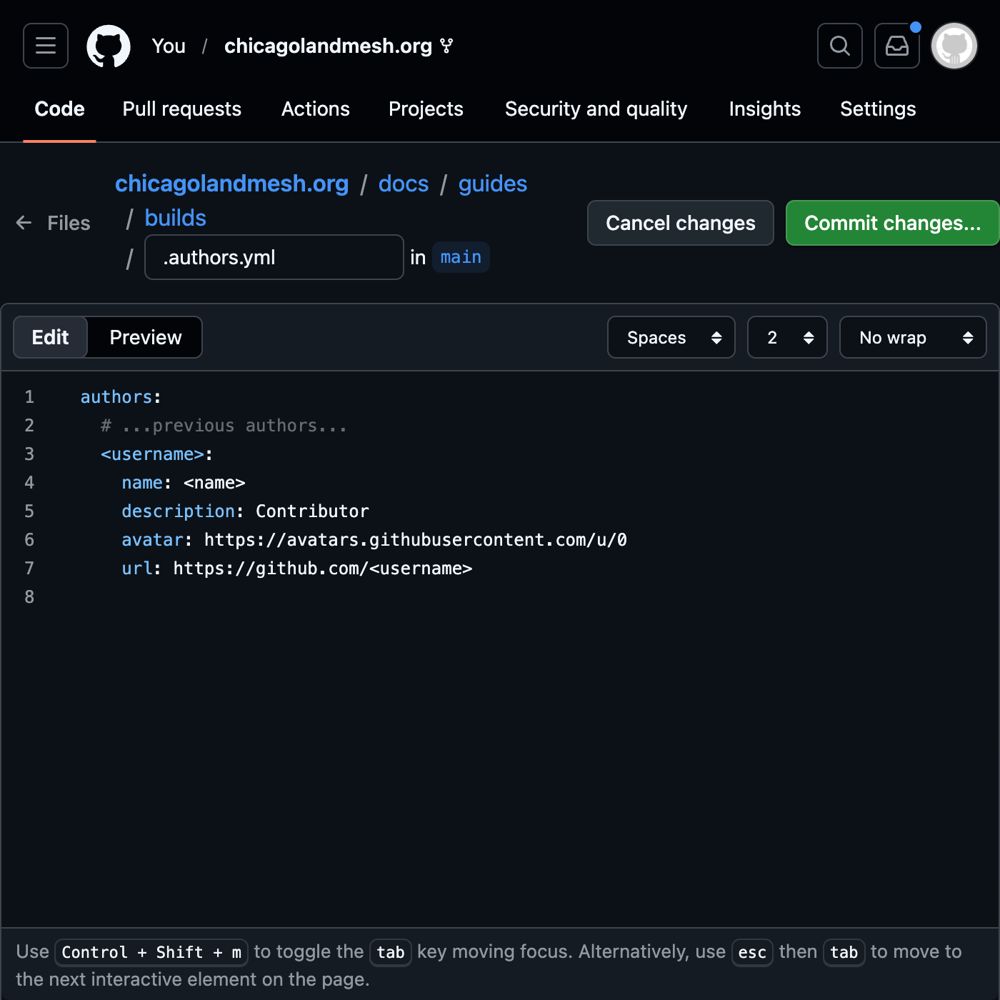
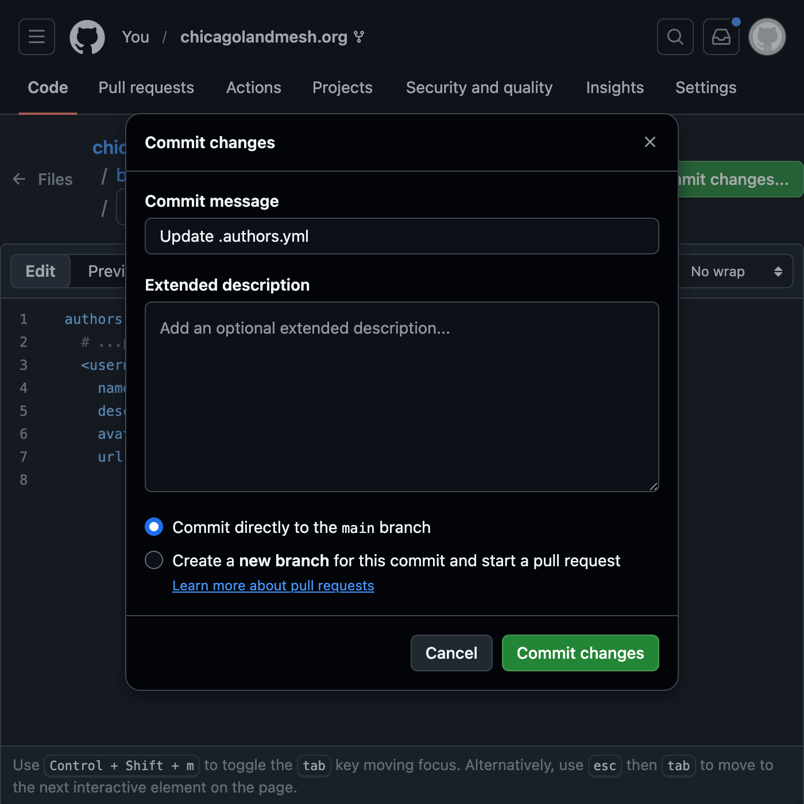
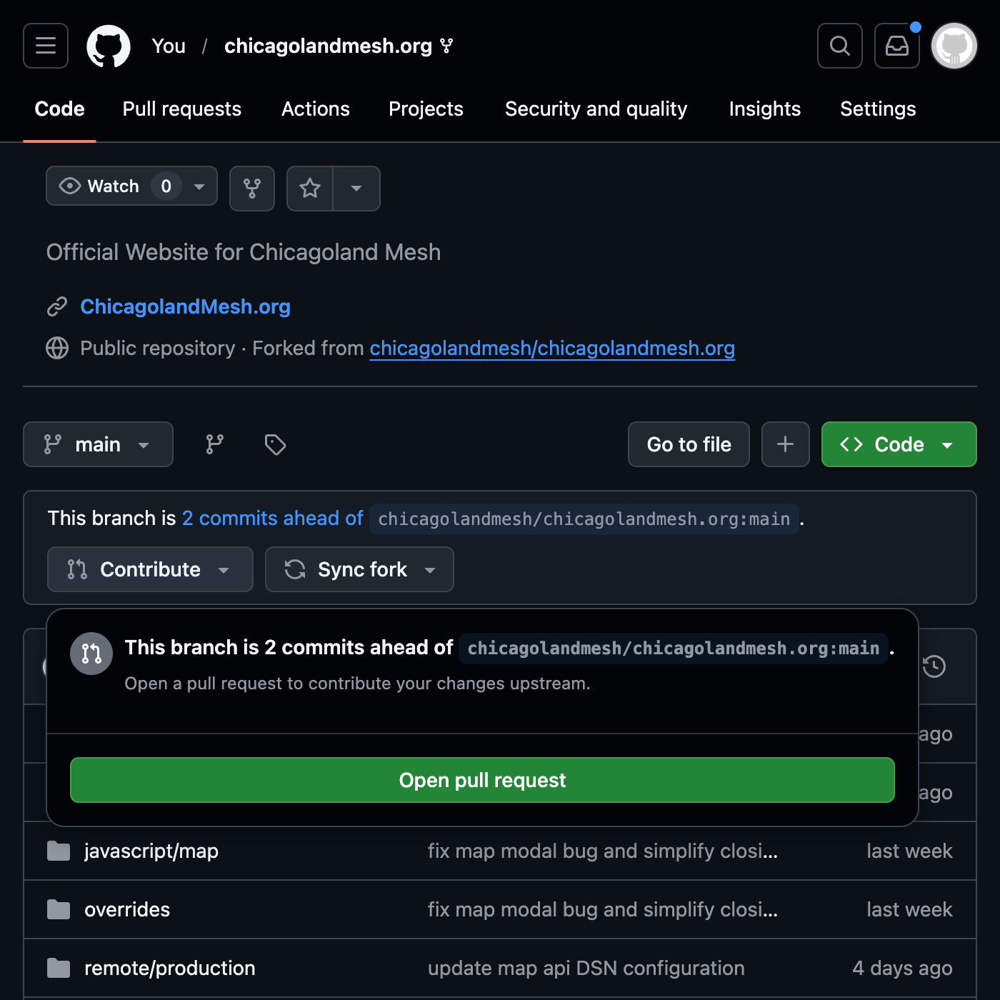
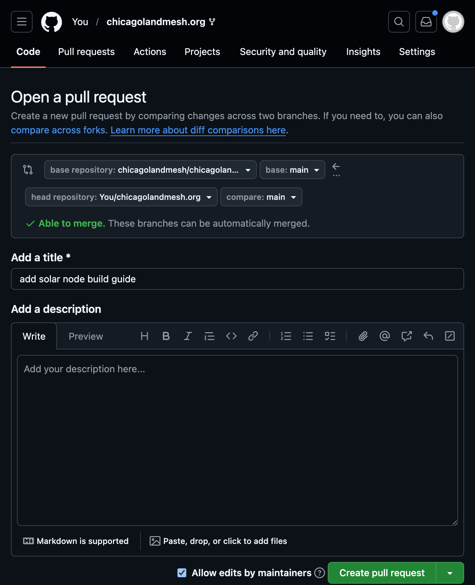

# How to Contribute

If you would like to contribute with a new guide or an improvement to the existing ones, please follow these steps:

<!-- more -->

<style>
  /* shift images to the left on mobile so it's aligned to the center */
  @media(max-width:768px) {
    .glightbox {
      margin-left: -0.75rem;
    }
    .highlight {
      margin-left: -0.75rem;
    }
  }
</style>

=== "Using GitHub directly"

    1. Fork the repository within GitHub or by clicking [here](https://github.com/chicagolandmesh/chicagolandmesh.org/fork)
    <br>
    { width=500 }

    2. Create the file by clicking **Add file**, then **Create new file**. In the file name field paste in `docs/guides/builds/posts/<guide-name>.md`, replacing `<guide-name>` with the name of your guide in lowercase. Make sure to replace spaces with dashes
    <br>
    { width=500 }

    3. Paste the Markdown skeleton below and replace the placeholders with your content. View the [Using the command line](#__tabbed_1_2) tab, at step 4 and 6, for more details on how to write markdown and how to add images.
    ```yaml
    ---
    date:
      created: 2026-03-31 # set to the current date (YYYY-MM-dd)
    categories:
      - fixed # set based on what type of guide it is (fixed, mobile, or solar)
    authors:
      - You # set your github username
    ---

    # Guide Title

    <!-- Your content here -->
    ```

    4. Write and commit the guide. Leave the commit options default
    <br>
    { width=500 }
    { width=500 }

    5. Add yourself to the `.authors.yml` file that way you are credited for the work you did! Replace `<username>` with the username you put in your guide's authors header and replace `<name>` with what you wish to be credited as. For the avatar URL, right click your GitHub profile picture and copy the link to the image
    <br>
    { width=500 }
    { width=500 }

    6. Submit a pull request by clicking **Contribute**, then **Open pull request** on the main page of your fork or by clicking [this link](https://github.com/chicagolandmesh/chicagolandmesh.org/compare). Leave a comment in the PR if you need any help!
    <br>
    { width=500 }
    { width=500 }

=== "Using the command line"

    1. [Fork](https://github.com/chicagolandmesh/chicagolandmesh.org/fork) the repository on GitHub

    2. Clone your new repository. Replace `<username>` with your GitHub account
    ```bash
    git clone https://github.com/<username>/chicagolandmesh.org
    ```

    3. Create your guide in markdown format within `docs/guides/builds/posts` folder using your favorite text editor. Replace `<guide-name>` with a short and descriptive name related to your guide
    ```bash
    vim docs/guides/builds/posts/<guide-name>.md # or your editor of choice
    ```

    4. Format your guide using [Markdown syntax](https://en.wikipedia.org/wiki/Markdown#Examples). You can view previous guides in `docs/guides/builds/posts/` for examples

    5. Make sure to include a date and categories header at the top of your guide as this is required for the website to build properly
    ```yaml
    ---
    date:
      created: 2026-03-31 # set to the current date (YYYY-MM-dd)
    categories:
        - fixed # set based on what type of guide it is (fixed, mobile, or solar)
    ---
    ```

    6. If you are adding images to the guide, please put them into `docs/assets/images/builds/` folder and reference them in the markdown file. The text within the brackets indicates text for screen readers and other assistive technology. More details on inserting images can be [found here](https://squidfunk.github.io/mkdocs-material/reference/images/)
    ```html
    

    <!-- or with a caption -->
    <figure markdown="span">
      
      <figcaption>This is the completed node in it's final form</figcaption>
    </figure>
    ```

    7. Add your attribution to `docs/guides/builds/.authors.yml` and to the header of your guide. Replace `<username>` with your GitHub username and replace `<name>` with the name you would like to be called in the guide. For the avatar URL, right click your GitHub profile picture and copy the link to the image. You can skip this step if you wish to contribute anonymously
    ```yaml title=".authors.yml"
    authors:
      # ...previous authors...
      <username>:
        name: <name>
        description: Contributor
        avatar: # right click copy paste your profile picture from github
        url: https://github.com/<username>
    ```
    ```yaml
    ---
    # ...previous options...
    authors:
      - <username>
    ---
    ```

    8. To view your work before submitting it, run the following command in the root directory of the repository. This requires [Docker](https://www.docker.com/get-started/) to be installed. After that visit `http://localhost:8080` in your browser
    ```bash
    make dev/site
    ```

    9. Commit and push your changes
    ```bash
    git add .
    git commit -m "add build guide <name>"
    git push origin main
    ```

    10. Open a [pull request](https://github.com/chicagolandmesh/chicagolandmesh.org/compare) on GitHub

Thank you for contributing!
