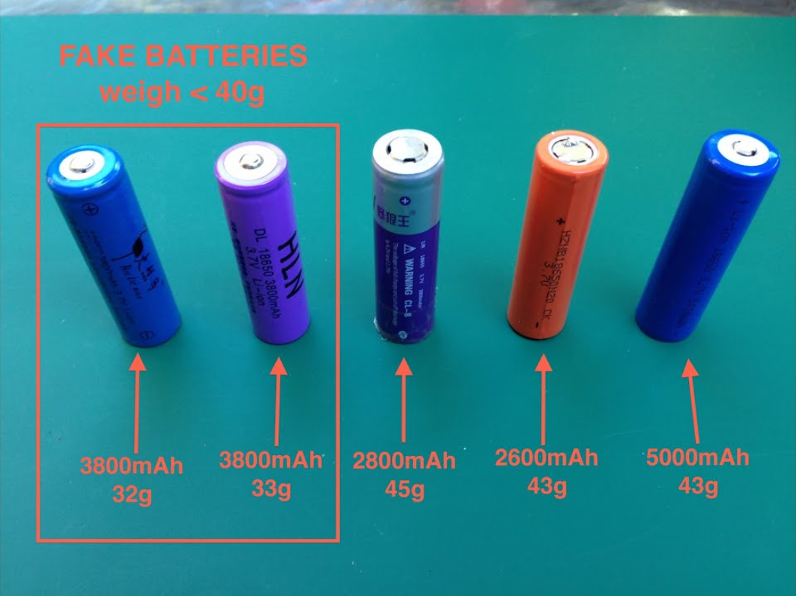

---
tags:
  - Info
  - Getting Started
  - MeshCore
---

#### Do NOT power on your node without an antenna!
   Very self-explanatory, just don't try it! It can damage your node's LoRa chip permanently.

#### Mount antennas upright and minimize cable length between the node and antenna.
   Having your antenna in a vertical position at the highest possible level is the best case. Also, small adjustments such as keeping the cable connecting the antenna to the node as short as possible will help. Keeping the cable vertical and not bent will ensure you get the best connection possible; antennas with a hinge typically perform worse while bent.

#### Avoid sketchy batteries
   [18650 Batteries](https://en.wikipedia.org/wiki/18650_battery) are very common in MeshCore builds for their large capacity and rechargability. They are lithium-ion batteries first created for use in laptops. Many fake or misleading manufacturers will sell batteries that are way above their capacity. Stick to name brands like *Samsung* or *Panasonic*. A big hint that a battery is fake is if the weight is under 40 grams.
   

#### Pay attention to SMA cables
   When you are purchasing SMA cables and adapters make sure you check the gender of the antenna and cables you're going to use. Mismatched connectors may cause permanent damage to your node, possibly leaving it unusable.

#### Avoid using stock Lilygo or Heltec antenna
   Using the stock antennas from Lilygo and Heltec devices will result in a massive performance loss because of their very high [SWR](https://en.wikipedia.org/wiki/Standing_wave_ratio). The lower SWR the better. We recommend checking out this [GitHub repository](https://www.rfindex.com/mesh/antennas) for choosing the best antenna for your node.

#### Set up an admin password on Repeater and Room Server nodes
   If you are deploying an infrastructure node, we strongly recommend setting up the admin password so you can control your node through another node wirelessly. Instructions for this are available [here](https://docs.meshcore.io/faq/#31-q-how-do-you-configure-a-repeater-or-a-room-server). The guest password should either be left blank or set to `hello`.

#### Do not use the Room Server role unless absolutely necessary
   The `Room Server` role should be reserved for nodes with poor placement, for example, inside of an Apartment building.  Room Server nodes store messages like an old school BBS system. If you are deploying a stationary node on a building, please use the `Repeater` role as it will route packets much better than `Room Server`. If you're unsure which role to choose, please join our [Discord](https://ChiMesh.org/discord) and ask!
