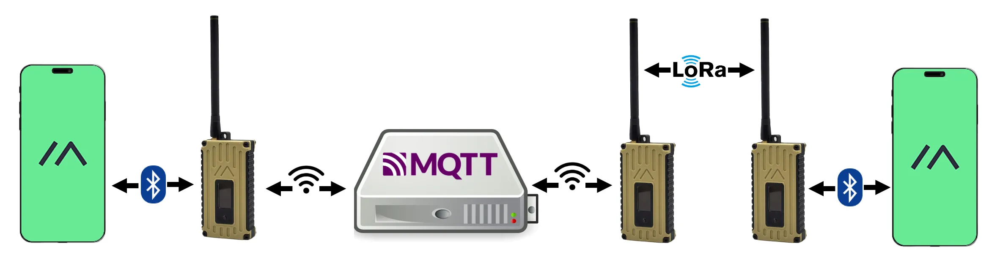
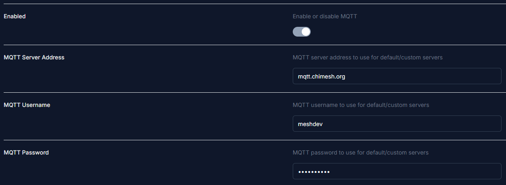
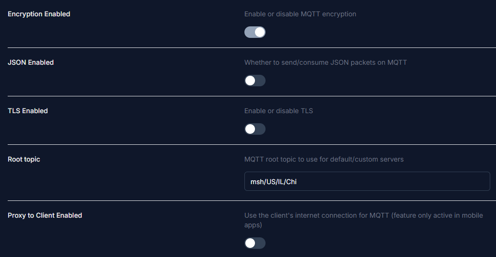
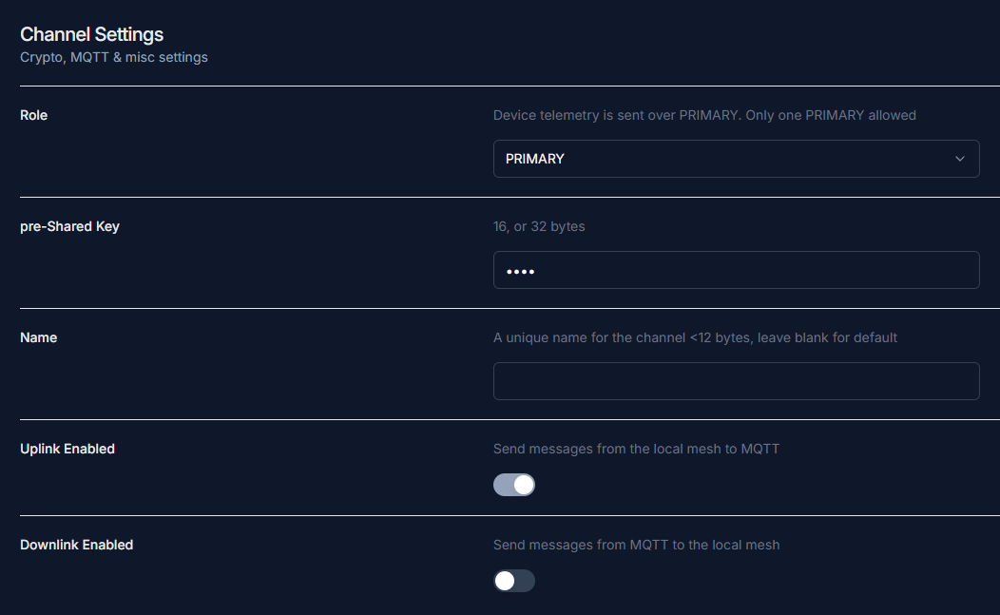

## What is MQTT?

MQTT stands for Message Queuing Telemetry Transport. It is a protocol that has been integrated into Meshtastic to allow nodes to relay messages over the internet, bridging gaps where a physical connection would otherwise not be possible.

<figure markdown="span">
  { data=round }
  <figcaption><a href="https://meshtastic.org/docs/software/integrations/mqtt/">Image source</a></figcaption>
</figure>

---

## MQTT Settings

Enabling MQTT will allow your node to appear on [Liam Cottle MeshMap](https://meshtastic.liamcottle.net/), [Global MeshMap](https://meshmap.net), and [Chicagoland MeshView](https://chicagolandmesh.org/analyzers).

1. Go to your MQTT settings and select **Enable**.

2. Set the following connection details:

    | Field | Value |
    |---|---|
    | MQTT Server Address | `mqtt.chimesh.org` |
    | Username | `meshdev` |
    | Password | `large4cats` |

    

3. **Enable** MQTT encryption.

4. Ensure **JSON** and **TLS** are both disabled.

5. Set your root topic to `msh/US/IL/Chi`.

    !!! warning
        The root topic field is case-sensitive. Do not include any leading or trailing spaces.

6. Configure the **Proxy to Client** setting based on your connection type:
    - **Wi-Fi** — Set Proxy to Client to `Off`
    - **Phone/Bluetooth** — Set Proxy to Client to `On`

    

7. Go to **Channel Settings**, then open the **Primary Channel** and configure the following:

    | Field | Value |
    |---|---|
    | Pre-shared Key | `AQ==` |
    | Name | *(leave blank)* |
    | MQTT Uplink | `Enabled` |
    | MQTT Downlink | `Disabled` |

    !!! info
        Uplink sends messages received by your node to MQTT. Disabling downlink prevents your node from receiving messages back from MQTT. See [Optional Settings](#optional-settings) for more detail.

8. Enable **Map Reporting**, set the Map Publish Interval to `3600` seconds, and choose your desired Position Precision.

    

---

## Optional Settings

1. If you are using a mobile device, make sure **Connect to Mesh** is enabled.

2. The uplink and downlink settings can be adjusted to your preference if you want to communicate with others through MQTT. The instructions above reflect the configuration standard we recommend.

3. We recommend having at least **uplink enabled** on the primary channel with **device position enabled**, so your node appears on [Liam Cottle MeshMap](https://meshtastic.liamcottle.net/), [Global MeshMap](https://meshmap.net), and [Chicagoland MeshView](../../meshview/index.md).
