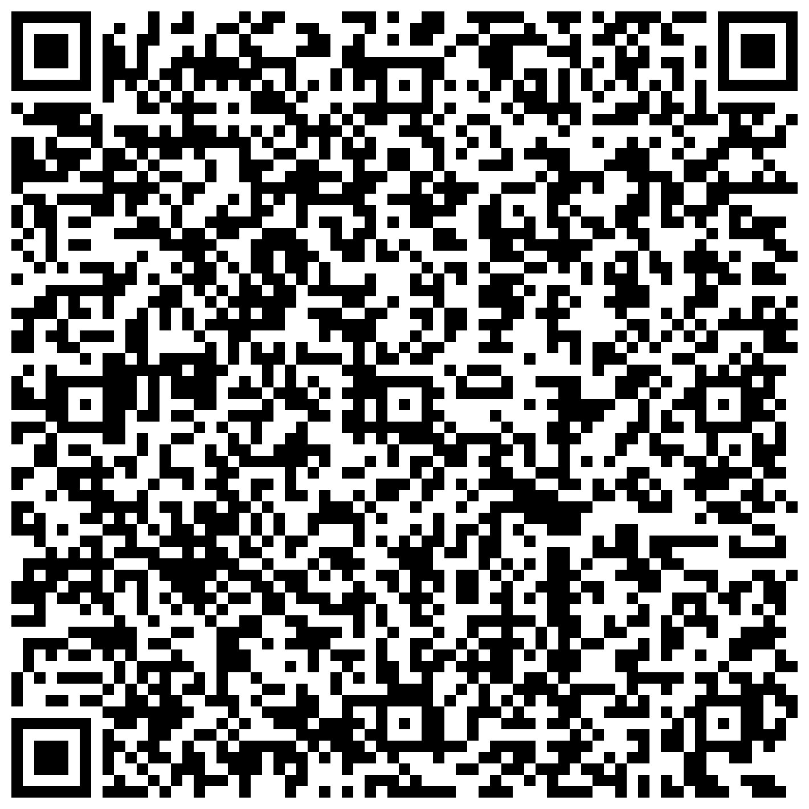

---
tags:
  - Events
  - VCFMW
  - MeshCore
  - Meshtastic
hide:
  - navigation
---

# VCFMW Mesh Info

**MeshCore** and **Meshtastic** will both be active at **[VCFMW](https://vcfmw.org/)**, the 21st Vintage Computer Festival Midwest, at the Schaumburg Convention Center on September 12 and 13, 2026.

If you already have a LoRa node, bring it. People travel from all over the country for VCFMW, and everyone is welcome to join the event mesh. You do not need to live in Chicagoland to [join the Discord](https://chimesh.org/discord), and you are welcome to stay after the event.

<link rel="stylesheet" href="https://cdn.jsdelivr.net/npm/pannellum@2.5.7/build/pannellum.css">

  <noscript>Enable javascript to view panorama.</noscript>

## Live Mesh Monitoring

You can monitor mesh activity during the festival using the Chicagoland Mesh tools:

- **[Analyzers](analyzers/index.md)** for live mesh monitoring and statistics
- **[CoreScope](corescope/index.md)** for MeshCore
- **[MeshView](meshview/index.md)** for Meshtastic

Event forum: **[VCFMW Discord event forum](https://discord.com/channels/1218078395565608990/1532573340001370343)**

- MeshCore event post: **[VCFMW MeshCore discussion](https://discord.com/channels/1218078395565608990/1545105751771709481)**
- MeshCore MQTT feed: **[VCFMW MeshCore MQTT feed](https://discord.com/channels/1218078395565608990/1545151388043051099)**
- Meshtastic event post: **[VCFMW Meshtastic discussion](https://discord.com/channels/1218078395565608990/1545105867844624465)**
- Meshtastic MQTT feed: **[VCFMW Meshtastic MQTT feed](https://discord.com/channels/1218078395565608990/1545151744533602417)**

## Join the Community

The **[VCFMW](https://vcfmw.org/)** mesh is open to everybody.

You do not need to be from Chicago. You do not need to be an exhibitor. You do not need an amateur radio license to participate in the normal unlicensed LoRa mesh setup described here.

If you are traveling from another state or another country, [join our Discord](https://chimesh.org/discord) before the show and stay afterward if you want. Chicagoland Mesh is open to anyone interested in MeshCore, Meshtastic, Reticulum, LoRa, and off-grid communications.

## Support VCFMW

Vintage Computer Festival Midwest is free to attend, but putting on a show this large costs money. If you enjoy **[VCFMW](https://vcfmw.org/)** and want to help keep it going, please consider [donating to the event](https://vcfmw.org/donate).

## What Should I Bring?

If you already own a MeshCore or Meshtastic device, bring it charged and bring a USB cable or battery pack.

Running both protocols is welcome, but use separate radios unless your hardware and firmware specifically support both at the same time.

A small antenna is usually plenty inside the convention center. More antenna and more transmit power are not automatically better in a room full of nearby radios.

If something is not working, ask in Discord or find somebody from Chicagoland Mesh at the show.

## Dedicated Repeaters

It would be nice to have one strategically placed **MeshCore observer repeater** and one strategically placed **Meshtastic Router** available during event to help provide consistent coverage throughout the convention center. Ideally, the repeaters should be mounted as high as possible in the main show room with reliable power for the duration of the event. A Station G2, Station G3, or another solid repeater platform would be a good fit.

We only want to coordinate **one event repeater/router per protocol**. Too there are too many in the same area it can create unnecessary traffic and make things worse instead of better. If you are interested in hosting one, please reach out in the **[VCFMW MeshCore discussion channel](https://discord.com/channels/1218078395565608990/1545105751771709481)** so we can decide who will host it and where it will be placed.

Attendees do not need to set their personal nodes to Repeater. Normal companion nodes should stay as companions.

## MeshCore Setup

1. Flash the latest stable MeshCore companion firmware for your device using the [MeshCore Flasher](https://flasher.meshcore.io)
2. Connect to the node with the MeshCore app
3. Select `USA/Canada Recommended` for the radio preset
4. Set **Region Scope / IATA** to `ORD`
5. Set **Path Hash Byte Mode** to `2`, which is equal to the 3 byte setting
6. Add the `#vcfmw` hash channel and any other event specific channels you want:

    | Channel | MeshCore Hashtag | Derived Key |
    |---|---|---|
    | VCFMW | `#vcfmw` | `8827f3fbba1a7a3b6049ea0a531f914e` |
    | Buy, Sell, Trade | `#buyselltrade` | `51332f8708a57aff6d84f2bef882c61e` |
    | Video Games | `#videogames` | `a1a6349b218b7519d08a7654788f722a` |
    | Retro Computing | `#retrocomputing` | `75f637103fd8f17c8d051cba60487d9c` |
    | Meetups | `#meetups` | `1e04bf3679e19c1277757375e5dbff7c` |

7. Set your display name to something people at the show can recognize
8. Send a quick hello in `#vcfmw` hash channel

## Meshtastic Setup

VCFMW will not use the normal Meshtastic `LongFast` radio preset. A crowded indoor event is exactly the kind of environment where the faster `ShortTurbo` profile makes sense. It keeps packets on the air for less time, which helps when a lot of nodes are trying to talk in the same building. The event-specific channels listed below should be added as Secondary channels.

!!! tip "Back Up Your Current Settings"

    Before changing your Meshtastic configuration for VCFMW, consider backing up your current configuration so you can easily restore your normal settings after the event.

Make sure to update or flash your node to a current Meshtastic firmware release, then:

1. Scan the following **QR code** or use [this link](https://meshtastic.org/e/#CgcSAQE6AggOCiASEHh2S25LNDkzZEsxRjE5bVIaBXZjZm13JQIAAAA6AAoiEhDwntwR44BCZGLdr3b3OptDGgdidXlzZWxsJQMAAAA6AAolEhCw1RysCrnecMNbo29drVsXGgp2aWRlb2dhbWVzJQQAAAA6AAokEhCNBaRYjUMddUQdxKEvaV2YGglyZXRyb2NvbXAlBQAAADoACiISED6CrI5BAWxpdTzRxWDSd8kaB21lZXR1cHMlBgAAADoAEhUIARAIGPQDIAcoBTgBQAdIAVAWaAE) to set channels and settings, else follow the steps below to configure manually.

    {width=400px}

2. Set **Region** to `US`
3. Set **Modem Preset** to `ShortTurbo`
4. Set **Frequency Slot** to `50`
5. Set **Hop Limit** to `4`
6. Keep your device role set to `Client`
7. Set `ShortTurbo` as your Primary channel
8. Add the following event channels:

    | Channel | Type | Meshtastic Radio Name | PSK | MQTT Uplink | MQTT Downlink |
    |---|---|---|---|---|---|
    | ShortTurbo | Primary | `ShortTurbo` | Default | Enabled | Disabled |
    | VCFMW | Secondary | `vcfmw` | `eHZLbks0OTNkSzFGMTltUg==` | Enabled | Disabled |
    | Buy, Sell, Trade | Secondary | `buysell` | `8J7cEeOAQmRi3a929zqbQw==` | Enabled | Disabled |
    | Video Games | Secondary | `videogames` | `sNUcrAq53nDDW6NvXa1bFw==` | Enabled | Disabled |
    | Retro Computing | Secondary | `retrocomp` | `jQWkWI1DHXVEHcShL2ldmA==` | Enabled | Disabled |
    | Meetups | Secondary | `meetups` | `PoKsjkEBbGl1PNHFYNJ3yQ==` | Enabled | Disabled |

9. Enable **MQTT Uplink** on the primary channel and all five event secondary channels
10. Keep **MQTT Downlink disabled** on every channel
11. Set your display name to something people at the show can recognize
12. Send a test message in the `vcfmw` channel

### Meshtastic MQTT Uplink

If your node has internet access through Wi-Fi, Ethernet, or the phone client proxy, we encourage you to uplink VCFMW traffic to the **ChiMesh MQTT server**. The purpose of MQTT during VCFMW is statistics and visibility. Uplink allows packets seen by participating nodes to contribute to MeshView, Analyzers, and the Meshtastic MQTT feed.

!!! warning "MQTT Settings"

    Make sure to enable MQTT uplink on every configured channel and keep MQTT downlink disabled on every channel.

Downlink is not needed for what we are doing at the event. Leaving it disabled also prevents internet MQTT traffic from being injected back onto the local LoRa mesh and consuming additional airtime.

Use these MQTT settings:

| Setting | Value |
|---|---|
| **MQTT Enabled** | On |
| **Server Address** | `mqtt.chimesh.org` |
| **Username** | `meshdev` |
| **Password** | `large4cats` |
| **Encryption** | Enabled |
| **JSON** | Disabled |
| **TLS** | Disabled |
| **Root Topic** | `msh/US/IL/Chi` |
| **MQTT Uplink** | Enabled |
| **MQTT Downlink** | Disabled |

The root topic is case-sensitive, so enter `msh/US/IL/Chi` exactly as shown.

For the connection method:

- If the node has its own Wi-Fi connection, set **Proxy to Client** to `Off`.
- If the node is using your phone or Bluetooth connection for internet access, set **Proxy to Client** to `On`.

If you want your node included in compatible mapping tools, you can also enable **Map Reporting**, set the publish interval to `3600` seconds, and choose the position precision you are comfortable sharing.

Full details are available in our **[Meshtastic MQTT guide](guides/meshtastic/mqtt.md)**.
