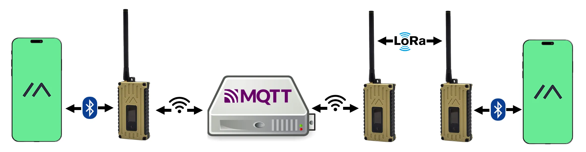
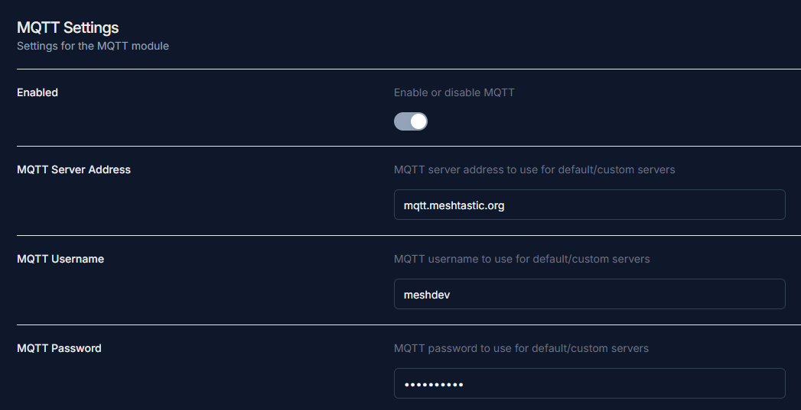
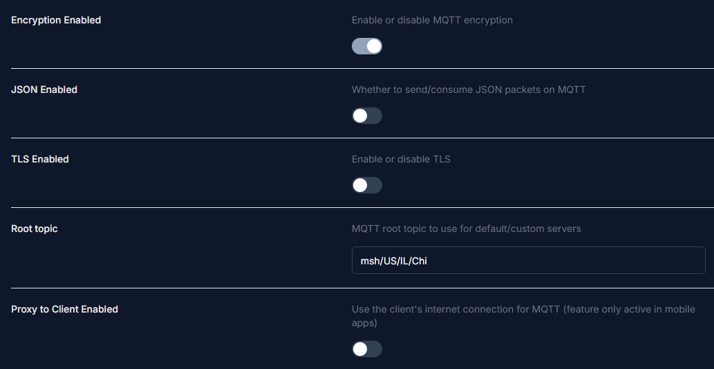
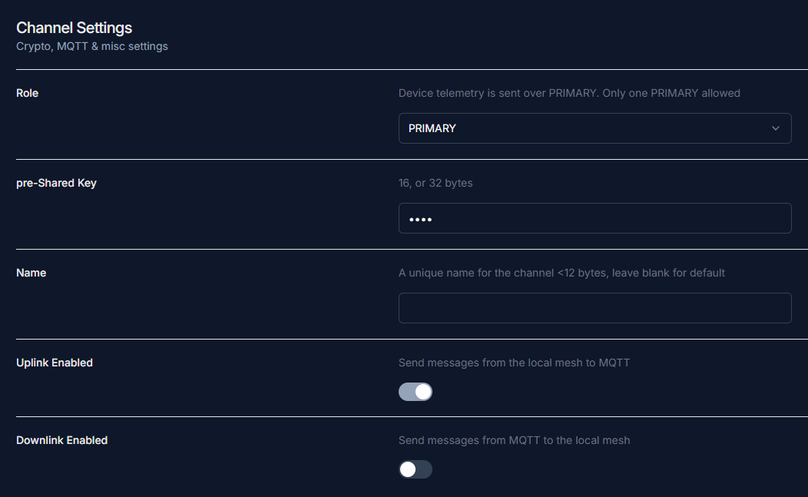

# Setting up MQTT for your node

## What is MQTT?
MQTT stands for Message Queuing Telemetry Transport. It is a protocol that has been integrated into Meshtastic to allow nodes to relay messages over the internet. This allows nodes to bridge where physically they couldn't have. 

<figure markdown="span">
  { data=round }
  <figcaption><a href="https://meshtastic.org/docs/software/integrations/mqtt/">Image source</a></figcaption>
</figure>

## MQTT Settings
Enabling MQTT will allow you to connect to us and appear on the [Global MeshMap](https://meshmap.net).

1. Go to your MQTT settings and select enable.
2. Use `mqtt.meshtastic.org` for MQTT server address
3. Use `meshdev` for MQTT username
4. Use `large4cats` for MQTT password

     
    
     
     

5. Enable MQTT encryption
6. Make sure JSON and TLS are disabled
7. Set your root topic to `msh/US/IL/Chi`

    !!! note

        Input text is case sensitive.

8. If you are using Wi-Fi, set Proxy to Client off, if you are using a phone, turn on Proxy to Client

     
    
     
     

9. Go to channel settings and then primary channel
10. Set the pre-Shared key to `AQ==`
11. Leave the name blank
12. Enable MQTT uplink and disable downlink
    - This is set to send messages recieved to MQTT but prevents your node from getting messages from MQTT. Read more about this in the [optional settings](#optional-settings-below).
13. Enable Map Reporting, set Map Publish Interval to 30 (seconds), and set your desired Position Precision

     
    

### Optional Settings

1. If you are using a mobile device, Make sure to enable Connect to mesh
2. The uplink and downlink settings can be changed to your preference if you want to contact others through MQTT. These instructions were created for the standard set by us
3. We recommend having at least uplink enabled on the primary channel and device position enabled so you get on [MeshMap](https://meshmap.net)